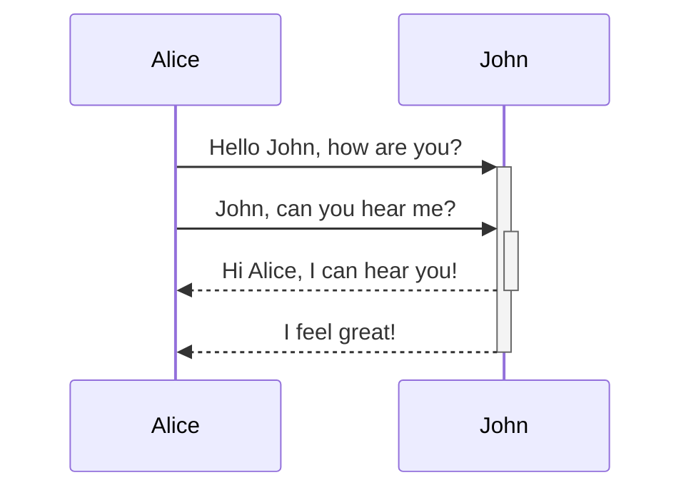

# Markdown Tools (mdt)

This project implements a few utilities for markdown files that I need personally.

Currently, it is implementing functionality to wrap mermaid diagrams with an HTML block that renders the code with an URL pointing to mermaid ink

