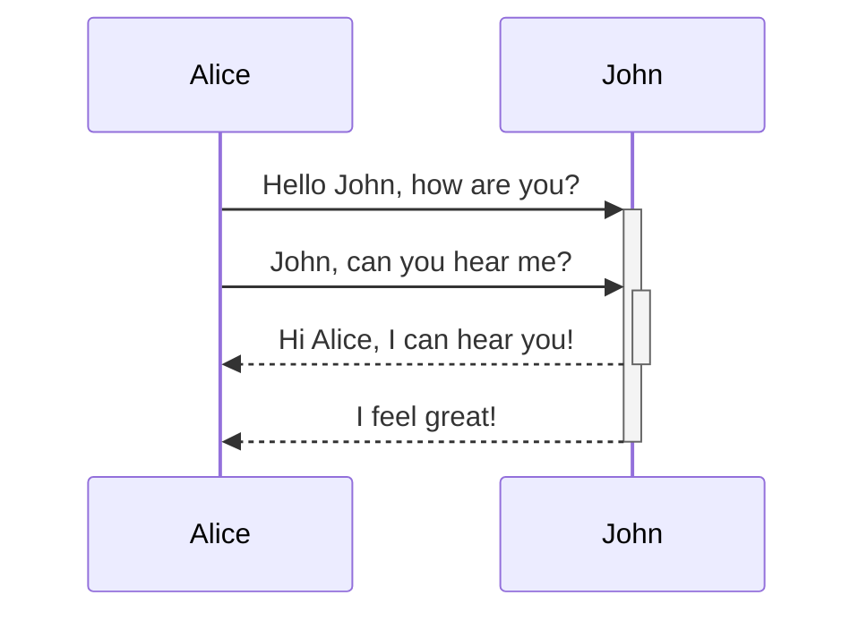

# Markdown Tools (mdt)

This project implements a few utilities for markdown files that I need personally.

Currently it is implemente a functionality to wrap mermaid diagrams with a html block that renders the code with an url pointing to mermaid ink

</img>

